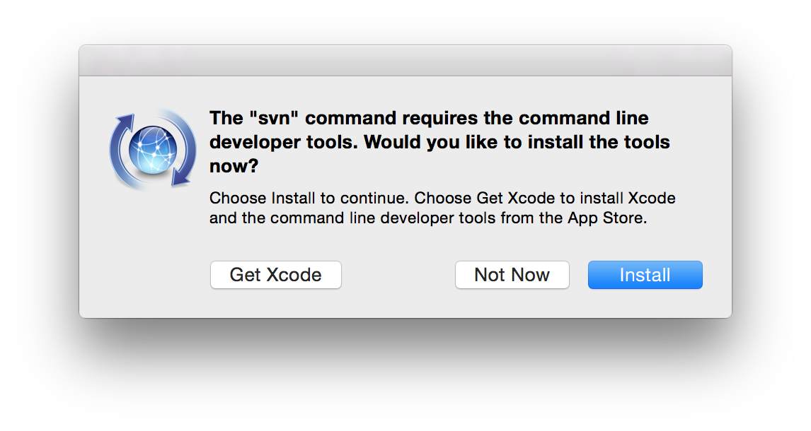

# Module Sync Script
Command-line script for syncing modules between a single source project and many target projects.

### Requirements and Considerations
- A Mac OSX comupter connected to a power source
- Subversion (SVN), _see instructions below_
- Access to the Terminal app
- Enough disk space to store the modules for all projects in the sync

## Installation
This script requires SVN, the tool used to download and update Inkling Habitat projects. Begin by checking to see if SVN is installed:

__Note:__ For beginners, the expresssion "running a command" means typing it into the Terminal window and pressing return/enter.

#### Install SVN
1. Open the Terminal app, and run `svn --version`

    If you see `svn, version 1.x.x ...` and copyright information then SVN is installed. The version must be 1.6 or higher.

    If you instead see an Xcode Installation menu like the picture below, follow the steps to complete installation of SVN.
    

#### Authenticate SVN
User credentials and authentication will need to be stored before the script can be run. To do this, we'll simply connect to our source project.

1. Run the command below using your source project shortname and Habitat login credentials:
    <pre>
    svn info https://svn.inkling.com/svn/[project shortname] --username [Habitat username] --password [Habitat password]
    </pre>

    SVN will attempted to connect to your project using the credentials provided

2. If you get the error below, type `p` to permanently accept the certificate.
    ```
    Error validating server certificate for 'https://svn.inkling.com:443'
    - The certificate is not issued by a trusted authority.
    ...
    (R)eject, accept (t)emporarily or accept (p)ermanently?
    ```

3. If successful, you should see information about the project:
    ```
    Path: [shortname]
    URL: https://svn.inkling.com/svn/[shortname]
    Repository Root: https://svn.inkling.com/svn/[shortname]
    ...
    ```
    If SVN was unable to connect, double check your credentials and make sure you have access to the Habitat project.


#### Install sync-modules script

1. <a href="https://github.com/inkling/content-scripts/archive/bash-modules-sync.zip">Click here</a> to download the entire content-scripts repository as a ZIP file. Feel free to clone/pull instead if you're familiar with Git/Github.
2. Unzip and move the `bash/sync-modules` folder to a location on your computer (This is the only folder you need from the repository). When running the script, copies of the modules in each project will be placed in this folder, so make sure you have sufficient disk space.

    Example: `/Documents/Inkling/Tools/sync-modules`

---
## Sync Modules

#### Prepare the list of projects
The script uses a CSV (comma-separated values) file to determine the source project and list of target projects in the following format:

<table>
    <tr>
        <td>Shortname <small>(required)</small></td>
        <td>Title <small>(optional)</small></td>
    </tr>
    <tr>
        <td>sn_source</td>
        <td>Source Title</td>
    </tr>
    <tr>
        <td>sn_target1</td>
        <td>Target1 Title</td>
    </tr>
    <tr>
        <td>sn_target2</td>
        <td>Target2 Title</td>
    </tr>
</table>
<ul>
    <li><small><b>Row 1</b></small> Column Labels, do not delete!</li>
    <li><small><b>Row 2</b></small> Source Project</li>
    <li><small><b>Row 3</b></small> Target Project</li>
    <li><small><b>Row 4+</b></small> Additional Target Projects</li>
</ul>


In CSV format, the same data looks like this:
```
Shortname,Title
sn_source,Source Title
sn_target1,Target1 Title
sn_target2,Target2 Title
```

For ogranization, we recommend keeping the data in a spreadsheet and exporting as CSV when you're ready to run the script. You can make a copy of Inkling's <a href="https://docs.google.com/a/standardnine.com/spreadsheets/d/1lqET9VLV0oxILhzJC6zH1xq4CIfPojXO_fUxuhMJssA/edit?usp=sharing" target="_blank">Project Sync Google Sheet</a> as a good starting point.

###### Ensuring quality of the CSV file
It's good practice to ensure the CSV is formatted correctly before using with the script. Some spreadsheet applications will add additional rows or columns that can cause issues. Below are two examples of improperly formatted CSV files.

<table>
    <tr>
        <td><small>Delete any excess data in columns C+</small></td>
        <td><small>Delete any excess data in the empty rows</small></td>
    </tr>
    <tr>
        <td><pre>Shortname,Title,,,,,
sn_source,Source Title,,,,,
sn_target1,Target1 Title,,,,,
sn_target2,Target2 Title,,,,,</pre>

        </td>
        <td><pre>Shortname,Title
sn_source,Source Title
sn_target1,Target1 Title
sn_target2,Target2 Title
,
,
</pre>
        </td>
    </tr>
</table>

#### Run the script

1. Export your project list as a CSV file
    - Google Sheets: File -> Download As... -> Comma-separated values (.csv)
    - Excel: File -> Save as... and set Format to Mac Comma Separated (.csv)

2. Rename the CSV to `project-list.csv` and place it in the `/sync-modules` folder.

3. Open the Terminal and navigate to your `/sync-modules` folder. A quick shortcut is to drag the `/sync-modules` folder onto the Terminal icon in the dock.

4. In the Terminal, run `bash sync-modules.sh`. This will start the script by reading the data from `project-list.csv`.

5. Before the sycn begins, you'll be prompted to review the source and target projects. If you see any errors, exit the script (enter `n`) and make any changes to the project list.

6. If the review is correct, enter `y` to begin the sync. The script will being by downloading the modules from the source project. Then the script will download the first target project, copyr (or overwrite) any modules from the source, and commit the changes back to Habitat.

7. When complete, any projects that failed commit will be added to the fail-log.csv. Use this file to re-run the script on just the projects that failed to commit.

##### Failed projects

It's possible that a project can fail to commit due to a timeout of connectivity. Any projects that fail to commit are added to the `failed-projects.csv`. This file can then be used as the project list.

Example: `bash sync-modules.sh -f failed-projects.csv`

### Options
The script accepts several option flags for more flexibility.

### `-f FILENAME`
The `-f` flag allows you to set a project list other than the default (`project-list.csv`). This is useful is you want to maintain several CSV files for different source/target lists or to re-run the script on any projects that failed commit due to a project timeout or connectivity issue.

Example 1: `bash sync-modules.sh -f different-project-list.csv`

Example 2: `bash sync-modules.sh -f failed-projects.csv`

### `-d`
The `-d` flag will run the script in __delete mode__. This means that any additional modules in the target project that are not in source will be deleted.

<table>
    <tr>
        <td><code>bash sync-modules.sh</code></td>
        <td><code>bash sync-modules.sh <span>-d</span></code></td>
    </tr>
    <tr>
        <td>
            
            <small>Modues <b>not</b> in the source project are preserved</small>
        </td>
        <td>
            
            <small>Modues <b>not</b> in the source project are deleted</small>
        </td>
    </tr>
</table>
