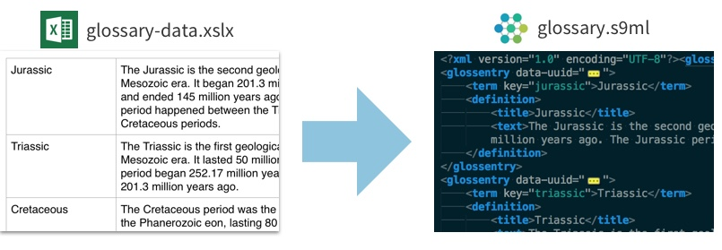

# Excel to Inkling Glossary
Generate an Inkling glossary file from an Excel spreadsheet (xlsx).

# Installation
1. Download the repo and run `npm install`
2. Place your excel spreadsheet in the same folder and rename to `glossary-data.xlsx`. The first column will be the terms and the second column will be the description. Remove any header rows.

# Build the glossary
1. Run `npm run start` from the folder. A `glossary.s9ml` file will be generated.
2. Copy the content into your glossary.s9ml file or commit the new file via SVN.

